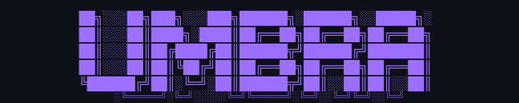
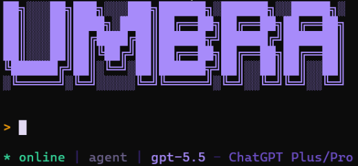
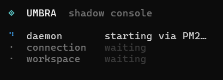
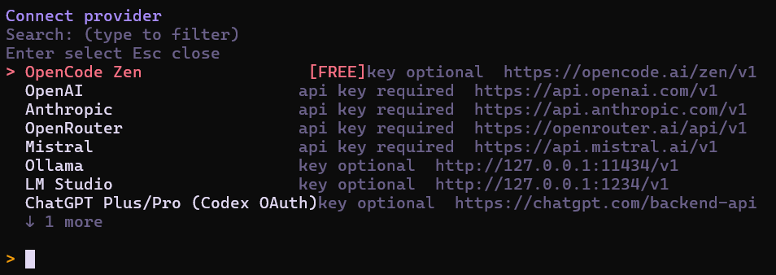
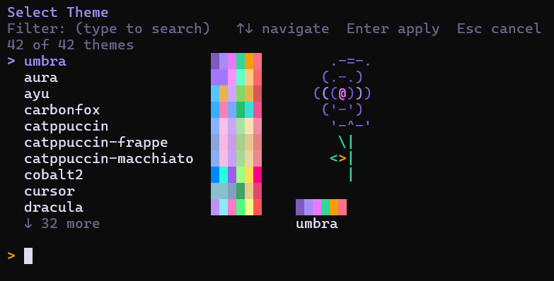
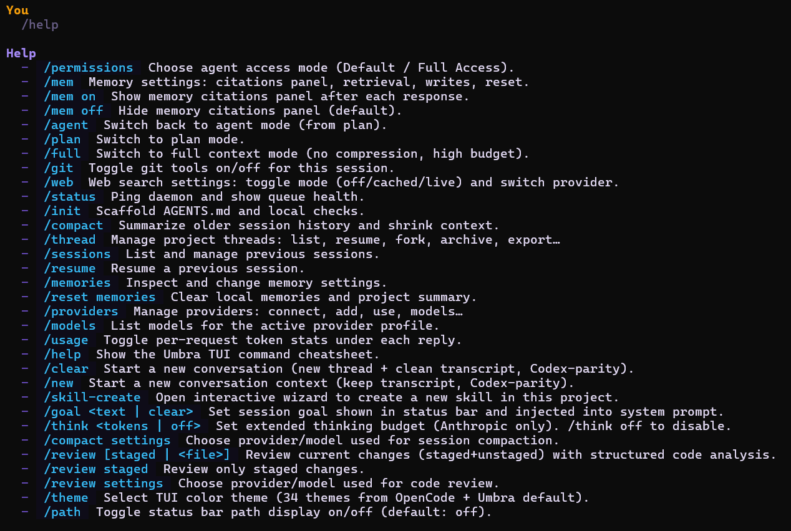

# Umbra Agent

<div align="center">

<a href="https://umbra.expert">
  
</a>
&nbsp;
<a href="https://discord.gg/dW6uFFJ6WF">
  
</a>

<br>

<a href="docs/en_documentation.md">
  
</a>


</div>

---

<div align="center">



</div>

---

AI coding agent focused on saving tokens and autonomous task execution. Works with any LLM provider — including local models.

---

## The Problem

Every LLM subscription has a token limit — and it runs out faster than you think. The bigger your project, the longer your session, the more you hit the wall: the model loses context mid-task, responses degrade, and you either start over or pay for a bigger plan.

Most AI coding tools make this worse. They dump entire files into the prompt, keep full session history forever, and never compress anything. You burn through your daily or monthly limit doing work that should have cost a fraction of that.

## The Solution

Umbra is built around one goal: **keep the model effective without wasting tokens.**

It builds a compact AST map of your project instead of sending raw files, compresses tool output and session history automatically, and recalls relevant past work from a local vector database — injecting only what actually matters for the current task. You get a model that stays coherent across long sessions and large codebases, at a fraction of the token cost.

The autonomous loop is there too — Umbra can run tasks end-to-end without babysitting — but the core value is that it stops burning your budget on context you don't need.

---

## Screenshots

<div align="center">

&nbsp;
<br>
&nbsp;
<br>


</div>

---

## Key features

- **Token-aware context engine** — repo map, retrieval packets, split-turn compression, session compaction. Stays within budget automatically.
- **40+ language parsers** — AST-based project outline for JavaScript, TypeScript, Python, Go, Rust, and many more.
- **Persistent memory** — one SQLite database across all projects. Past solutions indexed and recalled via vector search.
- **Provider-agnostic** — OpenAI, Anthropic, Mistral, Ollama, LM Studio, OpenCode Zen (free), and any OpenAI-compatible endpoint.
- **Autonomous Harness Loop** — runs your check script, reads failures, sends them to the model, iterates until it passes. No babysitting.
- **Local-first** — your code stays on your machine. Nothing sent to third parties beyond the provider you choose.

---

## Requirements

- **Node.js v22+**
- **pnpm** (preferred) or **npm**

---

## Installation

**curl:**
```bash
curl -fsSL https://umbra.expert/install.sh | sh
```

**PowerShell (iwr):**
```powershell
iwr https://umbra.expert/install.ps1 | iex
```

**npm / pnpm:**
```bash
npm install -g umbra-agent
# or
pnpm add -g umbra-agent
```

---

## Quick start

```bash
umbra
```

Starts the daemon, opens the TUI, and stops cleanly when you exit. The agent is ready immediately.

---

## Documentation

Full reference — commands, configuration, architecture, providers, and more:

**[docs/en_documentation.md](docs/en_documentation.md)**

---

## Contributing

See [CONTRIBUTING.md](CONTRIBUTING.md).

---

## License

MIT — see [LICENSE](LICENSE).

---

<div align="center">

<a href="https://discord.gg/dW6uFFJ6WF">
  
</a>

</div>
